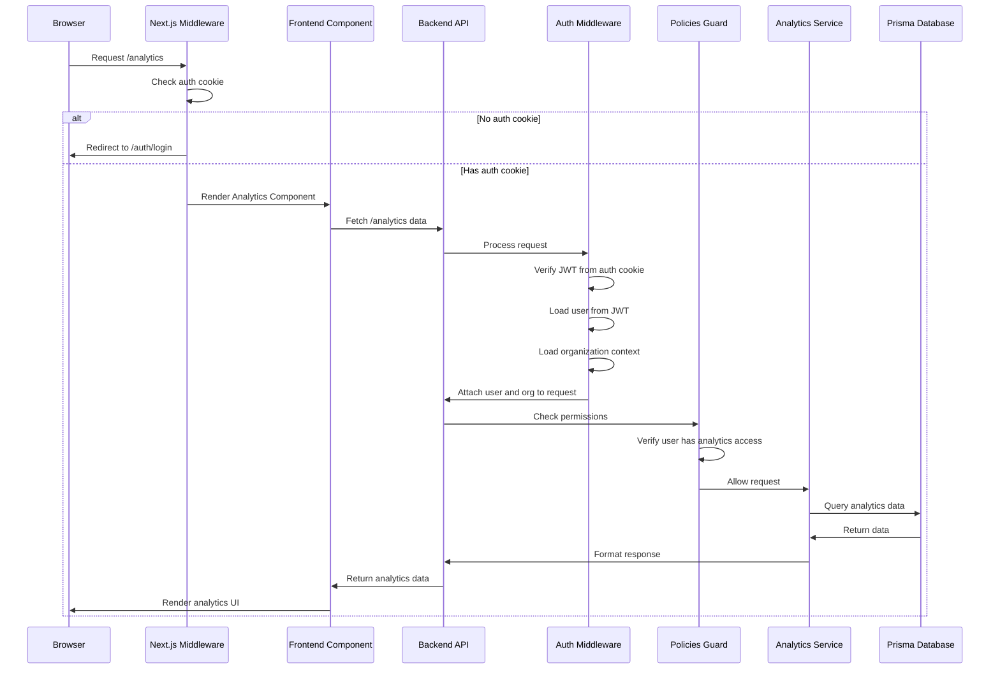

# Authentication Flow Diagram

The following diagram illustrates the complete authentication flow in the Postiz application, from browser request to database access.

## How to View This Diagram

To view this diagram properly:

1. **GitHub**: If you're viewing this on GitHub, the Mermaid diagram should render automatically.

2. **VS Code**: Install the "Markdown Preview Mermaid Support" extension to view Mermaid diagrams in the markdown preview.

3. **Mermaid Live Editor**: Copy the diagram code and paste it into the [Mermaid Live Editor](https://mermaid.live/) to view and edit it.

4. **Export as Image**: You can export the diagram as an image from the Mermaid Live Editor and include it in your documentation.

## Diagram Explanation

This sequence diagram shows:

1. The browser makes a request to a protected page (/analytics)
2. Next.js middleware checks for the auth cookie
3. If no auth cookie is present, the user is redirected to the login page
4. If the auth cookie is present, the page is rendered and data is fetched
5. The backend API processes the request through the auth middleware
6. The JWT token is verified and user/organization data is loaded
7. Permissions are checked by the policies guard
8. If all checks pass, the service queries the database
9. Data is returned to the frontend and rendered in the UI
