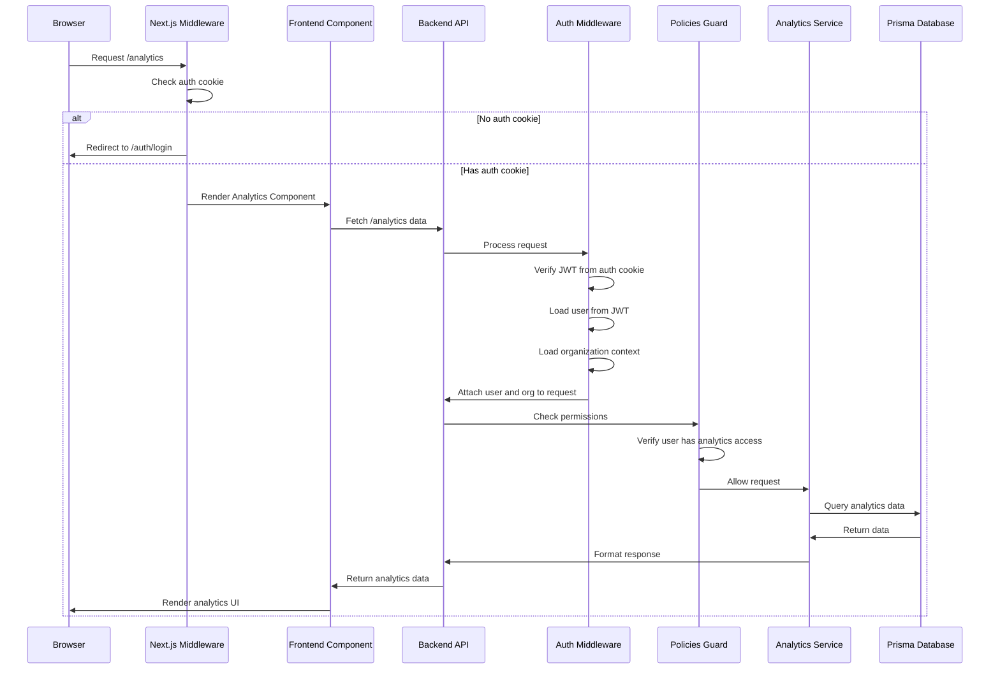

# Authentication Flow Documentation

This document provides a detailed overview of the authentication and page-access flow in the Postiz application.

## Table of Contents

1. [Overview](#overview)
2. [Frontend Authentication](#frontend-authentication)
   - [Middleware Protection](#middleware-protection)
   - [Protected Pages](#protected-pages)
   - [Auth Pages](#auth-pages)
3. [Backend Authentication](#backend-authentication)
   - [Authentication Middleware](#authentication-middleware)
   - [JWT Verification](#jwt-verification)
   - [Permission-Based Access Control](#permission-based-access-control)
   - [Protected Routes](#protected-routes)
4. [Cookie & Token Flow](#cookie--token-flow)
   - [Login Process](#login-process)
   - [Cookie Setting](#cookie-setting)
   - [Organization Context](#organization-context)
   - [JWT Verification Process](#jwt-verification-process)
5. [Complete Authentication Flow](#complete-authentication-flow)
   - [Sequence Diagram](#sequence-diagram)
   - [Detailed Flow](#detailed-flow)
6. [Security Considerations](#security-considerations)

## Overview

The Postiz application implements a comprehensive authentication system using JWT (JSON Web Tokens) stored in HTTP-only cookies. The system includes:

- Frontend route protection via Next.js middleware
- Backend route protection via NestJS middleware
- Role-based and permission-based access control
- Organization context management
- Support for multiple authentication providers (Local, GitHub, Google, etc.)

## Frontend Authentication

### Middleware Protection

The primary authentication mechanism in the frontend is implemented in `apps/frontend/src/middleware.ts`. This middleware intercepts all requests and enforces authentication rules:

```typescript
export async function middleware(request: NextRequest) {
  const nextUrl = request.nextUrl;
  const authCookie = request.cookies.get('auth');
  
  // Allow access to static resources without authentication
  if (nextUrl.pathname.startsWith('/uploads/') || 
      nextUrl.pathname.startsWith('/p/') || 
      nextUrl.pathname.startsWith('/icons/')) {
    return NextResponse.next();
  }
  
  // Handle logout
  if (nextUrl.href.indexOf('/auth/logout') > -1) {
    // Clear auth cookie and redirect to login
    // ...
  }
  
  // Redirect unauthenticated users to login
  if (nextUrl.href.indexOf('/auth') === -1 && !authCookie) {
    // Redirect to auth page with appropriate parameters
    // ...
  }
  
  // Redirect authenticated users away from auth pages
  if (nextUrl.href.indexOf('/auth') > -1 && authCookie) {
    return NextResponse.redirect(new URL(`/${url}`, nextUrl.href));
  }
  
  // ...
}
```

The middleware applies to all routes except those explicitly excluded in the matcher configuration:

```typescript
export const config = {
  matcher: '/((?!api/|_next/|_static/|_vercel|[\\w-]+\\.\\w+).*)',
};
```

### Protected Pages

All pages outside of the `/auth/*` routes are protected and require authentication. The application uses a global middleware approach rather than per-page protection.

**Protected Pages Structure:**
- All pages under `apps/frontend/src/app/(site)/` are protected
- Default redirect target when unauthenticated: `/auth/login`

### Auth Pages

The following pages are part of the authentication flow and are accessible without authentication:

1. **Login Page**
   - Path: `/auth/login`
   - File: `apps/frontend/src/app/auth/login/page.tsx`
   - Component: `Login` from `apps/frontend/src/components/auth/login.tsx`

2. **Registration Page**
   - Path: `/auth`
   - File: `apps/frontend/src/app/auth/page.tsx`
   - Component: `Register` from `apps/frontend/src/components/auth/register.tsx`

3. **Password Reset Pages**
   - Path: `/auth/forgot`
   - File: `apps/frontend/src/app/auth/forgot/page.tsx`
   - Path: `/auth/forgot/[token]`
   - File: `apps/frontend/src/app/auth/forgot/[token]/page.tsx`

4. **Account Activation Pages**
   - Path: `/auth/activate`
   - File: `apps/frontend/src/app/auth/activate/page.tsx`
   - Path: `/auth/activate/[code]`
   - File: `apps/frontend/src/app/auth/activate/[code]/page.tsx`

## Backend Authentication

### Authentication Middleware

The backend uses `AuthMiddleware` to protect routes. This middleware is applied to all controllers except those explicitly excluded:

```typescript
// apps/backend/src/api/api.module.ts
const authenticatedController = [
  UsersController,
  AnalyticsController,
  IntegrationsController,
  SettingsController,
  PostsController,
  MediaController,
  BillingController,
  NotificationsController,
  MarketplaceController,
  MessagesController,
  CopilotController,
  AgenciesController,
  WebhookController,
  SignatureController,
  AutopostController,
];

@Module({
  // ...
})
export class ApiModule implements NestModule {
  configure(consumer: MiddlewareConsumer) {
    consumer.apply(AuthMiddleware).forRoutes(...authenticatedController);
  }
}
```

### JWT Verification

The JWT token is verified using the `AuthService.verifyJWT` method:

```typescript
// libraries/helpers/src/auth/auth.service.ts
static verifyJWT(token: string) {
  return verify(token, process.env.JWT_SECRET!);
}
```

This verification happens in the `AuthMiddleware` for each protected request.

### Permission-Based Access Control

Beyond authentication, the application uses a policy-based authorization system implemented with `PoliciesGuard`:

```typescript
// apps/backend/src/services/auth/permissions/permissions.guard.ts
@Injectable()
export class PoliciesGuard implements CanActivate {
  // ...
  async canActivate(context: ExecutionContext): Promise<boolean> {
    const request: Request = context.switchToHttp().getRequest();
    if (request.path.indexOf('/auth') > -1 || request.path.indexOf('/stripe') > -1) {
      return true;
    }

    const policyHandlers =
      this._reflector.get<AbilityPolicy[]>(
        CHECK_POLICIES_KEY,
        context.getHandler(),
      ) || [];

    if (!policyHandlers || !policyHandlers.length) {
      return true;
    }

    // eslint-disable-next-line @typescript-eslint/ban-ts-comment
    // @ts-expect-error
    const { org } : {org: Organization} = request;

    // @ts-ignore
    const ability = await this._authorizationService.check(org.id, org.createdAt, org.users[0].role, policyHandlers);

    // Check if any policy fails
    // ...
  }
}
```

Protected endpoints use the `@CheckPolicies()` decorator to specify required permissions:

```typescript
// Example from a controller
@Get()
@CheckPolicies([AuthorizationActions.Read, Sections.ANALYTICS])
async getAnalytics(@GetOrgFromRequest() organization: Organization) {
  // ...
}
```

### Protected Routes

All routes handled by the controllers in the `authenticatedController` array are protected. These include:

1. **User Management**
   - Controller: `UsersController`
   - Routes: `/user/*`
   - Required Auth: JWT token in auth cookie or header

2. **Analytics**
   - Controller: `AnalyticsController`
   - Routes: `/analytics/*`
   - Required Auth: JWT token + specific permissions

3. **Posts Management**
   - Controller: `PostsController`
   - Routes: `/posts/*`
   - Required Auth: JWT token + specific permissions

4. **Media Management**
   - Controller: `MediaController`
   - Routes: `/media/*`
   - Required Auth: JWT token

5. **Integrations**
   - Controller: `IntegrationsController`
   - Routes: `/integrations/*`
   - Required Auth: JWT token + specific permissions

## Cookie & Token Flow

### Login Process

1. **Login Request**:
   - Frontend sends credentials to `/auth/login`
   - Backend validates credentials and generates JWT

2. **Registration Process**:
   - Frontend sends registration data to `/auth/register`
   - Backend creates user account and generates JWT
   - If email verification is enabled, user must activate account

### Cookie Setting

When a user successfully authenticates, the JWT token is stored in an HTTP-only cookie:

```typescript
// apps/backend/src/api/routes/auth.controller.ts
response.cookie('auth', jwt, {
  domain: getCookieUrlFromDomain(process.env.FRONTEND_URL!),
  ...(!process.env.NOT_SECURED
    ? {
        secure: true,
        httpOnly: true,
        sameSite: 'none',
      }
    : {}),
  expires: new Date(Date.now() + 1000 * 60 * 60 * 24 * 365),
});
```

In development mode or when `NOT_SECURED` is set, the token is also sent as a header:

```typescript
if (process.env.NOT_SECURED) {
  response.header('auth', jwt);
}
```

### Organization Context

The application supports multiple organizations per user. The active organization context is determined by:

1. **Organization Selection**:
   - The `showorg` cookie or header determines which organization context is active
   - Set when switching organizations or during login:
   ```typescript
   response.cookie('showorg', addedOrg.organizationId, {
     domain: getCookieUrlFromDomain(process.env.FRONTEND_URL!),
     // ...
   });
   ```

2. **Admin Impersonation**:
   - Administrators can impersonate other users using the `impersonate` cookie
   - This allows viewing the application as another user for support purposes

### JWT Verification Process

The `AuthMiddleware` verifies the JWT token and populates the request with user and organization data:

```typescript
// apps/backend/src/services/auth/auth.middleware.ts
async use(req: Request, res: Response, next: NextFunction) {
  const auth = req.headers.auth || req.cookies.auth;
  if (!auth) {
    throw new HttpForbiddenException();
  }
  try {
    let user = AuthService.verifyJWT(auth) as User | null;
    const orgHeader = req.cookies.showorg || req.headers.showorg;

    if (!user) {
      throw new HttpForbiddenException();
    }

    if (!user.activated) {
      throw new HttpForbiddenException();
    }

    // Handle impersonation for admin users
    // ...

    delete user.password;
    const organization = (
      await this._organizationService.getOrgsByUserId(user.id)
    ).filter((f) => !f.users[0].disabled);
    const setOrg =
      organization.find((org) => org.id === orgHeader) || organization[0];

    if (!organization) {
      throw new HttpForbiddenException();
    }

    // eslint-disable-next-line @typescript-eslint/ban-ts-comment
    // @ts-expect-error
    req.user = user;

    // eslint-disable-next-line @typescript-eslint/ban-ts-comment
    // @ts-expect-error
    req.org = setOrg;
  } catch (err) {
    throw new HttpForbiddenException();
  }
  next();
}
```

## Complete Authentication Flow

### Sequence Diagram



### Detailed Flow

1. **Browser Request**:
   - User navigates to `/analytics`

2. **Next.js Middleware**:
   - Checks for `auth` cookie
   - If missing, redirects to `/auth/login`
   - If present, allows rendering of the Analytics component

3. **Frontend Component**:
   - Analytics component makes API request to fetch data
   - Uses `useFetch` hook which automatically includes cookies

4. **Backend API Request Processing**:
   - Request hits the `AnalyticsController`
   - Passes through `AuthMiddleware`

5. **Auth Middleware**:
   - Extracts JWT from `auth` cookie or header
   - Verifies JWT using `AuthService.verifyJWT`
   - Loads user data and organization context
   - Attaches user and org to the request object

6. **Policies Guard**:
   - Checks if the endpoint requires specific permissions
   - Verifies user has required permissions based on subscription tier

7. **Controller & Service**:
   - `AnalyticsController` processes the request
   - Uses `GetOrgFromRequest()` decorator to access organization context
   - Calls `AnalyticsService` methods

8. **Database Access**:
   - `AnalyticsService` uses Prisma to query the database
   - Returns formatted data to the controller

9. **Response**:
   - Controller returns data to the frontend
   - Frontend component renders the UI with the data

## Security Considerations

1. **JWT Storage**:
   - JWTs are stored in HTTP-only cookies to prevent JavaScript access
   - In production, cookies are set with `secure: true` to ensure HTTPS-only transmission
   - `sameSite: 'none'` is used to allow cross-site requests in certain scenarios

2. **Token Verification**:
   - All JWTs are verified on each request using the server's secret key
   - Expired or invalid tokens result in authentication failure

3. **Permission Checks**:
   - Beyond authentication, fine-grained permission checks are performed
   - Permissions are based on user roles and subscription tiers

4. **Organization Isolation**:
   - Users can only access data from organizations they belong to
   - Organization context is explicitly set and verified on each request

5. **Password Security**:
   - Passwords are hashed using bcrypt before storage
   - Password reset flows use time-limited tokens

6. **Environment Configuration**:
   - JWT secret is configured via environment variables
   - Development mode can be enabled with `NOT_SECURED` for easier debugging
