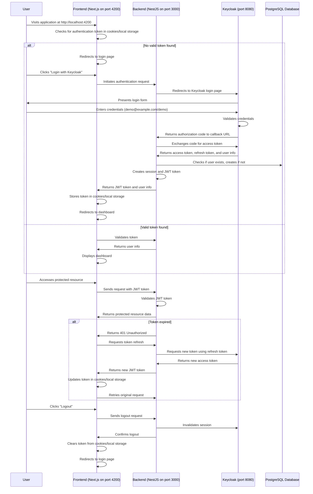

# Current Authentication Flow

This document describes the current authentication flow implemented in the Postiz application, which uses Keycloak as the identity provider.

## Table of Contents

1. [Authentication Flow Diagram](#authentication-flow-diagram)
2. [Detailed Authentication Flow Explanation](#detailed-authentication-flow-explanation)
3. [Authentication Components](#authentication-components)
4. [Security Considerations](#security-considerations)
5. [Integration with Other Services](#integration-with-other-services)

## Authentication Flow Diagram

## Detailed Authentication Flow Explanation

### Initial Authentication

1. **User Access**:
   - User navigates to the Postiz application at http://localhost:4200
   - The frontend (Next.js) checks for an existing authentication token in cookies or local storage

2. **Login Process**:
   - If no valid token is found, the user is redirected to the login page
   - User clicks "Login with Keycloak" button
   - The frontend makes a request to the backend to initiate the authentication process

3. **Keycloak Authentication**:
   - The backend redirects the user to the Keycloak login page (http://localhost:8080)
   - Keycloak presents a login form to the user
   - User enters credentials (demo@example.com/demo)
   - Keycloak validates the credentials against its user database

4. **Token Exchange**:
   - Upon successful authentication, Keycloak redirects back to the backend's callback URL (http://localhost:3000/auth/callback) with an authorization code
   - The backend exchanges this code for an access token by making a request to Keycloak's token endpoint
   - Keycloak returns an access token, refresh token, and user information

5. **User Session Creation**:
   - The backend checks if the user exists in the PostgreSQL database
   - If the user doesn't exist, a new user record is created
   - The backend creates a session and generates a JWT token containing user information
   - The JWT token and user information are returned to the frontend

6. **Session Establishment**:
   - The frontend stores the JWT token in cookies or local storage
   - The user is redirected to the dashboard or home page

### Authenticated Requests

1. **Accessing Protected Resources**:
   - When the user accesses a protected resource, the frontend includes the JWT token in the request header
   - The backend validates the JWT token
   - If valid, the backend processes the request and returns the protected resource data

2. **Token Refresh**:
   - If the JWT token has expired, the backend returns a 401 Unauthorized response
   - The frontend detects this and initiates a token refresh process
   - The backend uses the refresh token to request a new access token from Keycloak
   - Keycloak validates the refresh token and issues a new access token
   - The backend generates a new JWT token and returns it to the frontend
   - The frontend updates the stored token and retries the original request

### Logout Process

1. **User Logout**:
   - User clicks the "Logout" button in the application
   - The frontend sends a logout request to the backend
   - The backend invalidates the session in Keycloak
   - The backend confirms the logout to the frontend
   - The frontend clears the token from cookies or local storage
   - The user is redirected to the login page

## Authentication Components

### Frontend Components (Next.js)

- **Auth Context**: Manages authentication state across the application
- **Login Component**: Renders the login form and handles authentication requests
- **Protected Route Component**: Ensures routes are only accessible to authenticated users
- **Auth Service**: Handles token storage, validation, and refresh

### Backend Components (NestJS)

- **Auth Controller**: Handles authentication endpoints
- **Auth Service**: Manages authentication logic
- **Keycloak Provider**: Implements the ProvidersInterface for Keycloak integration
- **JWT Strategy**: Validates JWT tokens for protected routes
- **Auth Guard**: Protects routes from unauthorized access

### Keycloak Configuration

- **Realm**: master
- **Client**: postiz
- **Client Secret**: postiz
- **Redirect URI**: http://localhost:3000/auth/callback
- **Demo User**: Username: demo@example.com, Password: demo

## Security Considerations

1. **Token Storage**:
   - JWT tokens are stored in HTTP-only cookies to prevent XSS attacks
   - Refresh tokens are stored securely on the server side

2. **Token Validation**:
   - All tokens are validated on every request to ensure they haven't been tampered with
   - Tokens include expiration times to limit their validity period

3. **CSRF Protection**:
   - The application implements CSRF tokens to prevent cross-site request forgery attacks

4. **Secure Communication**:
   - All communication between components uses HTTPS (in production)
   - Sensitive data is never exposed in URLs or logs

## Integration with Other Services

The authentication system is integrated with other services in the application:

1. **User Management**:
   - User profiles and permissions are stored in the PostgreSQL database
   - User data is synchronized between Keycloak and the application database

2. **API Access Control**:
   - API endpoints are protected based on user roles and permissions
   - Different user types have different access levels

3. **Social Media Integrations**:
   - The application supports various social media integrations that require authentication
   - These integrations use the authenticated user's context for authorization
