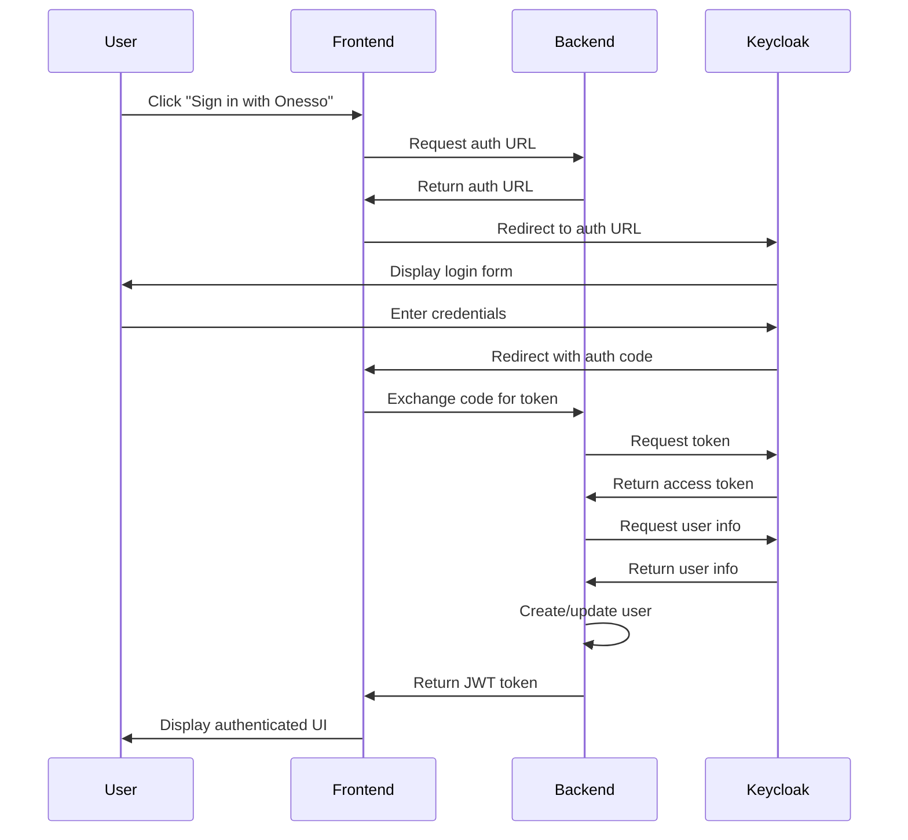
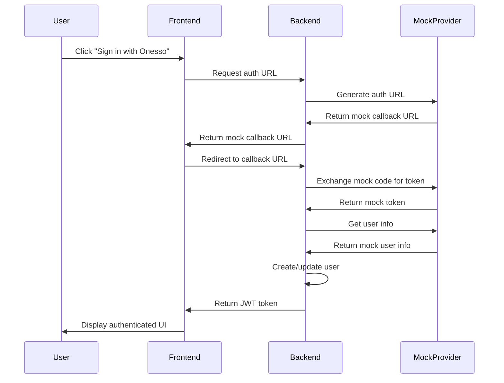

# Keycloak Authentication Flow

This document provides a visual representation of the authentication flow when using Keycloak (Onesso) as an authentication provider in the Postiz application.

## Authentication Flow Diagram

## Detailed Flow Explanation

1. **User Initiates Login**:
   - User clicks "Sign in with Onesso" on the login page
   - Frontend requests an authentication URL from the backend

2. **Redirect to Keycloak**:
   - Backend generates an authentication URL using the Keycloak configuration
   - Frontend redirects the user to the Keycloak login page

3. **User Authentication**:
   - User enters their credentials on the Keycloak login page
   - Keycloak validates the credentials
   - If valid, Keycloak generates an authorization code

4. **Callback Processing**:
   - Keycloak redirects back to the application's callback URL with the authorization code
   - Frontend sends the code to the backend

5. **Token Exchange**:
   - Backend exchanges the authorization code for an access token
   - Backend uses the access token to fetch user information from Keycloak

6. **User Creation/Update**:
   - Backend creates a new user or updates an existing user based on the information from Keycloak
   - Backend generates a JWT token for the user

7. **Authentication Complete**:
   - Backend returns the JWT token to the frontend
   - Frontend stores the token and displays the authenticated UI

## Mock Provider Flow

When using the mock provider (`USE_MOCK_KEYCLOAK=true`), the flow is simplified:

In this flow, the mock provider bypasses the actual Keycloak server and returns predefined values, allowing for development and testing without a running Keycloak server.
