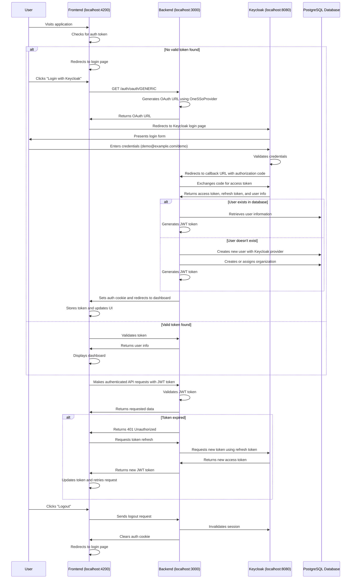
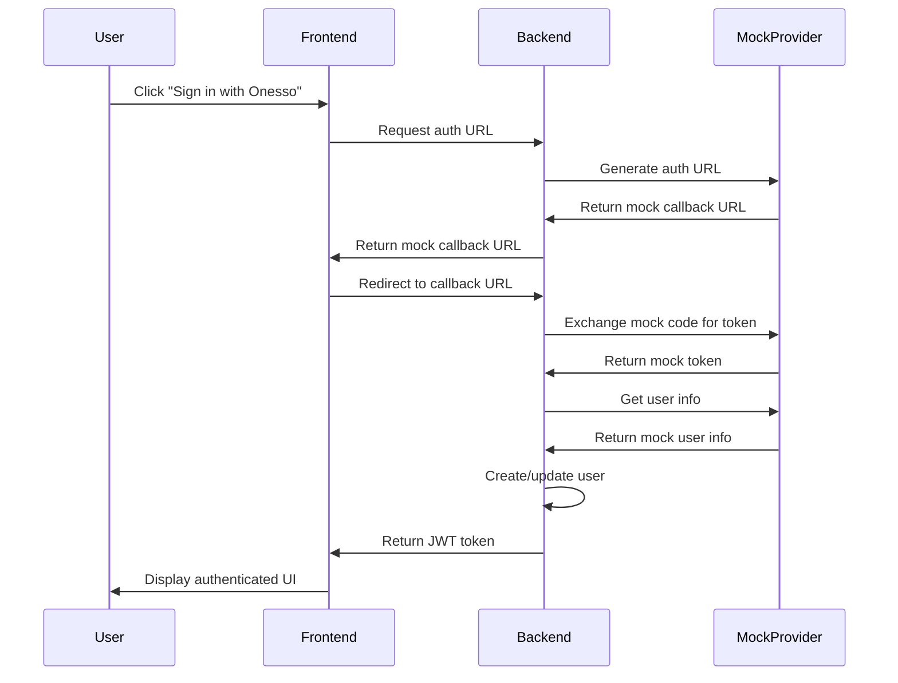

# Keycloak Authentication Flow

This document describes the authentication flow between the Postiz application (running on localhost:4200), Keycloak (the identity provider), and the backend service.

## Table of Contents

1. [Authentication Flow Diagram](#authentication-flow-diagram)
2. [Detailed Authentication Flow](#detailed-authentication-flow)
3. [Components Involved](#components-involved)
4. [Configuration Requirements](#configuration-requirements)
5. [Security Considerations](#security-considerations)
6. [Troubleshooting](#troubleshooting)
7. [Mock Provider Flow](#mock-provider-flow)

## Authentication Flow Diagram



## Detailed Authentication Flow

### Initial Authentication

1. **User Access**:
   - User navigates to the Postiz application at http://localhost:4200
   - The frontend checks for an existing authentication token in cookies or local storage

2. **Login Initiation**:
   - If no valid token is found, the user is presented with a login page
   - User clicks "Login with Keycloak" button
   - Frontend makes a request to the backend's OAuth endpoint: `GET /auth/oauth/GENERIC`

3. **OAuth URL Generation**:
   - Backend uses the `OneSSoProvider` to generate an OAuth URL for Keycloak
   - The URL includes client_id, redirect_uri, response_type, and scope parameters
   - Backend returns the OAuth URL to the frontend

4. **Keycloak Authentication**:
   - Frontend redirects the user to the Keycloak login page
   - Keycloak presents a login form to the user
   - User enters credentials (demo@example.com/demo)
   - Keycloak validates the credentials against its user database

5. **Authorization Code Exchange**:
   - Upon successful authentication, Keycloak redirects to the callback URL with an authorization code
   - Backend receives the code at the callback endpoint
   - Backend exchanges the code for an access token by making a request to Keycloak's token endpoint
   - Keycloak validates the code and returns an access token, refresh token, and user information

6. **User Processing**:
   - Backend checks if the user exists in the database by email or provider ID
   - If the user exists, the backend retrieves the user information
   - If the user doesn't exist, the backend creates a new user with the Keycloak provider
   - Backend generates a JWT token containing the user information

7. **Session Establishment**:
   - Backend sets the JWT token as an HTTP-only cookie named "auth"
   - Backend redirects the user to the dashboard
   - Frontend updates the UI to show the authenticated state

### Authenticated Requests

1. **API Requests**:
   - Frontend includes the JWT token in the Authorization header of API requests
   - Backend validates the JWT token for each request
   - If valid, the backend processes the request and returns the requested data

2. **Token Refresh**:
   - If the JWT token expires, the backend returns a 401 Unauthorized response
   - Frontend detects this and initiates a token refresh
   - Backend uses the refresh token to request a new access token from Keycloak
   - Backend generates a new JWT token and returns it to the frontend
   - Frontend updates the token and retries the original request

### Logout Process

1. **User Logout**:
   - User clicks the "Logout" button in the application
   - Frontend sends a logout request to the backend
   - Backend invalidates the session in Keycloak
   - Backend clears the auth cookie
   - Frontend redirects the user to the login page

## Components Involved

### Frontend Components

- **Auth Context**: Manages authentication state across the application
- **Login Component**: Renders the login form and handles authentication requests
- **Protected Route Component**: Ensures routes are only accessible to authenticated users
- **Auth Service**: Handles token storage, validation, and refresh

### Backend Components

- **OneSSoProvider**: Implements the ProvidersInterface for Keycloak integration
- **KeycloakAuthService**: Extends the AuthService to handle Keycloak-specific functionality
- **Auth Controller**: Handles authentication endpoints
- **JWT Strategy**: Validates JWT tokens for protected routes
- **Auth Guard**: Protects routes from unauthorized access

### Keycloak Components

- **Realm**: A security boundary containing users, credentials, roles, and groups
- **Client**: The application that requests Keycloak to authenticate a user
- **User**: The entity that can log into the system
- **Role**: A named entity that can be assigned to users

## Configuration Requirements

### Environment Variables

```
# Keycloak Configuration
ONESSO_BASE_URL=http://keycloak:8080
ONESSO_REALM=master
ONESSO_CLIENT_ID=postiz
ONESSO_CLIENT_SECRET=postiz
ONESSO_REDIRECT_URI=http://localhost:3000/auth/callback

# Application Configuration
FRONTEND_URL=http://localhost:4200
JWT_SECRET=your-jwt-secret
```

### Keycloak Configuration

1. **Create a Realm**:
   - Name: master

2. **Create a Client**:
   - Client ID: postiz
   - Client Protocol: openid-connect
   - Access Type: confidential
   - Valid Redirect URIs: http://localhost:3000/auth/callback
   - Web Origins: http://localhost:4200

3. **Create a User**:
   - Username: demo@example.com
   - Email: demo@example.com
   - Password: demo
   - Email Verified: true
   - Enabled: true

## Security Considerations

1. **Token Storage**:
   - JWT tokens are stored in HTTP-only cookies to prevent XSS attacks
   - Refresh tokens are stored securely on the server side

2. **Token Validation**:
   - All tokens are validated on every request to ensure they haven't been tampered with
   - Tokens include expiration times to limit their validity period

3. **CSRF Protection**:
   - The application implements CSRF tokens to prevent cross-site request forgery attacks

4. **Secure Communication**:
   - All communication between components uses HTTPS in production
   - Sensitive data is never exposed in URLs or logs

## Troubleshooting

### Common Issues

1. **Invalid Redirect URI**:
   - Ensure the redirect URI configured in Keycloak matches the callback URL in the application
   - Check for any URL encoding issues in the redirect URI

2. **Invalid Client Credentials**:
   - Verify that the client ID and client secret are correct
   - Check if the client is enabled in Keycloak

3. **User Not Found**:
   - Ensure the user exists in Keycloak
   - Check if the user is enabled and email is verified

4. **Token Validation Failures**:
   - Verify that the JWT secret is consistent across all instances
   - Check if the token has expired
   - Ensure the token hasn't been tampered with

## Mock Provider Flow

When using the mock provider (`USE_MOCK_KEYCLOAK=true`), the flow is simplified:



In this flow, the mock provider bypasses the actual Keycloak server and returns predefined values, allowing for development and testing without a running Keycloak server.
